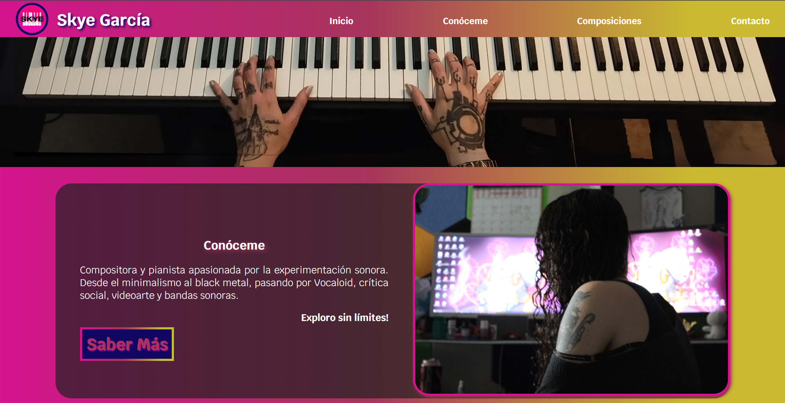

# Skye García — sitio web personal y portafolio musical

Sitio web oficial y portafolio interactivo de **Skye García**, compositora y pianista enfocada en la experimentación sonora. La plataforma reúne sus composiciones, trayectoria artística y canales de contacto directo para proyectos musicales y colaboraciones.

🌐 **Página web en producción:** [https://skyemusic.netlify.app/](https://skyemusic.netlify.app/)

---

## 📸 Vista previa del proyecto



---

## ✨ Características principales

- **Portafolio de composiciones:** Sección dedicada con accesos directos a piezas musicales originales y proyectos.
- **Sección «Conóceme»:** Información biográfica sobre su trayectoria y enfoque experimental (minimalismo, metal, Vocaloid, videoarte, bandas sonoras).
- **Formulario de contacto:** Sistema integrado para consultas, colaboraciones y contrataciones.
- **Redes y plataformas integradas:** Enlaces a perfiles oficiales en Spotify, YouTube, TikTok e Instagram.
- **Diseño responsive:** Adaptación visual a distintos dispositivos y pantallas.

---

## 🛠️ Tecnologías utilizadas

- **HTML5:** Estructuración semántica del sitio web.
- **CSS3:** Estilos personalizados, efectos visuales y diseño adaptativo.
- **JavaScript (ES6+):** Interactividad y dinámicas de navegación.
- **Netlify:** Despliegue y alojamiento del sitio web.

---

## 📂 Estructura del repositorio

```text
Proyecto_Skye/
├── index.html              # Página principal
├── conoceme.html           # Página biográfica
├── mis_temas.html          # Catálogo de composiciones
├── style.css               # Hoja de estilos principales
├── script.js              # Lógica e interactividad en JS
└── assets/                 # Recursos multimedia del proyecto
    ├── Iconos/             # Logotipos e iconos de redes
    ├── images/             # Imágenes y capturas (Proyecto_SkyeMusic.png, portadas, fotos)
    ├── covers/             # Portadas de álbumes/sencillos
    ├── sounds/             # Archivos de audio
    └── works/              # Material complementario
